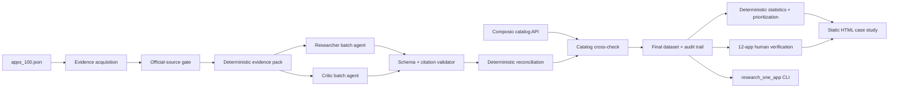

# 100-App Buildability Audit — Architecture

**Purpose:** implementation-ready architecture for the Composio Product Ops take-home. This document supplements, and does not modify, `composio_agent_spec.md`.

**Architecture status:** approved assumptions; ready for a builder to implement after the setup gate passes.

## 1. Product contract

The product is a reproducible research pipeline that produces one auditable record for each of the 100 assigned apps and renders a self-explanatory case-study HTML page. Its purpose is to answer whether an app can become an agent-callable toolkit today, why or why not, and what portfolio-level patterns follow from the evidence.

The submission must demonstrate all of the following:

- 100 complete records, each with an official-source evidence trail;
- research performed by a runnable agent/pipeline, not manual row filling;
- a visible verification loop and an honestly measured change from pass-one accuracy to final accuracy on a manually checked sample;
- calculated patterns and actionable prioritization, not an unanalysed table;
- a standalone HTML case study, repository README, and a runnable single-app trigger.

## 2. Fixed decisions and guardrails

| Decision | Chosen approach |
| --- | --- |
| Time remaining | Six to seven hours, including setup, full run, manual validation, case study, and submission preparation. |
| Research scope | All 100 assigned apps must receive an evidence-backed result. “Insufficient official evidence” and “not applicable” are valid results, never silent omissions. |
| Sources | Only official vendor documentation, developer portals, official product pages, official pricing pages, official repositories, and official announcements are admissible evidence. Search results are discovery only. |
| Composio usage | Use Composio Search for discovery/fetch where available and use the Composio toolkit catalog API/SDK for the catalog cross-check. A resilient public-HTTP fallback is permitted only if Composio Search cannot be executed after setup. |
| LLM | OpenRouter free tier. Design for a hard ceiling of 48 requests/day, with the full 100-app batch targeted at 34 requests or fewer after preflight. |
| Agent form | Plain Python modules with distinct roles and durable artifacts. No CrewAI/LangGraph orchestration dependency. The “agents” are well-bounded stages, not autonomous loops. |
| MCP field | Record `official_vendor_mcp` and `public_mcp_exists` separately. Only an official vendor MCP influences the core buildability assessment. |
| Buildability | Separate technical viability from access/commercial viability; publish a combined verdict plus the specific blocker. |
| Human verification | 12-app stratified sample: one per category plus two difficult or conflicted apps. |
| Delivery | Static, polished-enough HTML first. A hosted on-demand app is P2 only and may never jeopardize P0. |
| Confidentiality | Do not name, quote, link, or imply access to the parity/reference documents in the repository or case study. |

### Assignment-defined meaning of self-serve

Use the brief’s definition verbatim in the methodology: **self-serve means a developer can obtain credentials for free or on a trial; gated means paid plan, admin approval, partnership, contact-sales, or similar access is required.** To prevent ambiguity, store both `credential_path` and `gating_reasons` rather than relying on a single label.

## 3. System overview



### Why this architecture is trustworthy

1. The model can only read a bounded packet of official evidence; it cannot use remembered facts or invent uncited claims.
2. Researcher and critic independently derive the record. Agreement alone is not “verified.”
3. Code rejects malformed output, unapproved sources, missing citations, invalid enum values, and unsupported claims before publication.
4. Reconciliation preserves disagreement and pass history rather than overwriting it.
5. Human validation supplies the only reported before/after accuracy measurement. Never claim an improvement that the sample does not show.

## 4. Components and responsibilities

### 4.1 Seed registry

`data/apps_100.json` is the immutable assignment roster: app id, display name, category, and hint URL. The pipeline must assert exactly 100 unique IDs, exactly 10 categories, and 10 apps per category before running.

Add a small `data/app_source_policy.json` only when necessary. It maps each app to permitted official domains/repository owners and any known special case (for example, Mermaid CLI is an official GitHub project rather than a hosted SaaS). It is an allowlist, not manually written research.

### 4.2 Evidence acquisition adapter

**Input:** `AppSeed`  
**Output:** `RawEvidenceBundle`

The adapter proceeds in this order:

1. Normalize the hint into an HTTPS URL and attempt `COMPOSIO_SEARCH_FETCH_URL_CONTENT`.
2. If the hint is thin, use `COMPOSIO_SEARCH_WEB` to discover official documentation pages for the six research dimensions: auth, API, credential/pricing access, webhooks, MCP, and product/API overview.
3. Fetch no more than three accepted pages per app. Save the untouched response text and retrieval metadata under `data/raw_evidence/<app_id>/`.
4. Accept a page only if its final domain or official GitHub organization passes the per-app official-source policy. Redirects are checked after resolution.
5. If Composio Search is unavailable after the setup test, use a narrowly scoped direct public-HTTP fetch fallback and log `fetch_transport = "http_fallback"`. The application still uses Composio for the required catalog cross-check.

The pipeline must never quietly substitute a blog, competitor directory, Reddit post, or search-result summary for a source.

### 4.3 Deterministic evidence packer

Raw documentation is too large and noisy to batch safely. This pure-code stage:

- converts page content to readable text while preserving URL and title;
- selects paragraphs around configured terms such as `OAuth`, `API key`, `authentication`, `REST`, `GraphQL`, `pricing`, `trial`, `webhook`, `MCP`, and `rate limit`;
- preserves exact excerpts and assigns immutable IDs such as `E01`, `E02`;
- retains source URL/title and source type for every excerpt;
- caps the prompt payload at **4,500 characters per app** without cutting an excerpt mid-sentence;
- emits a coverage map identifying which required dimensions have direct evidence.

An evidence pack is a research input, not a substitute for the raw archive. The raw archive remains available for human validation.

### 4.4 Researcher agent

The researcher receives six evidence packs at a time and outputs exactly one compact JSON object per app (JSONL). It is instructed to use no external knowledge, to cite `E##` for every non-null claim, and to return `null` with `insufficient_evidence` when facts are absent.

Target budget: `ceil(100 / 6) = 17` requests. No batch retry is permitted. A malformed individual record joins the retry queue.

### 4.5 Critic agent

The critic receives the same evidence packs and the researcher output. It independently re-derives every field, identifies unsupported citations, and records field-level disagreements. It is not allowed to approve a claim merely because the researcher made it.

Target budget: 17 requests. Its output is also JSONL and subject to the same validator.

### 4.6 Schema and citation validator

This is the main anti-hallucination control. It runs independently on each agent output and fails a record when any of these occur:

- a required field is absent;
- an enum or nested type is invalid;
- a non-null factual field has no `E##` citation;
- a citation points to a non-accepted source or nonexistent excerpt;
- an enum value conflicts with the cited text under simple deterministic checks (for example, `OAuth2` when the cited excerpt only says API key);
- source URLs are missing from the published evidence list.

Failed fields become `null` / `insufficient_evidence`; failed records are retried individually only while the request budget permits.

### 4.7 Reconciler and decision engine

The reconciler is pure code. It produces the final value, field-level provenance, and a confidence state according to this precedence:

| Condition | Final value and confidence |
| --- | --- |
| Both passes agree and cite accepted primary evidence | value retained; `corroborated_primary` |
| One pass has valid direct evidence; the other is null/unsupported | supported value retained; `supported_primary` |
| Both cite compatible but non-identical values | normalized value retained; `supported_primary` and a note |
| Both disagree or citations support incompatible values | `null` or explicitly conflicting values; `conflicting` |
| Neither supports a value | `null`; `insufficient_evidence` |
| App type does not fit a field (e.g., CLI, no hosted API) | `not_applicable`, with cited rationale |

Do **not** call two-model agreement `verified`. Manual verification is reported separately, and only that sample can support an accuracy claim.

The decision engine determines:

- `technical_viability`: `ready`, `workaround_needed`, `no_public_api`, `not_applicable`, or `unknown`;
- `access_viability`: `self_serve`, `paid_or_admin_gated`, `partner_or_sales_gated`, `unknown`, or `not_applicable`;
- `combined_buildability`: `ready_now`, `buildable_with_access_constraint`, `buildable_with_technical_workaround`, `blocked`, `insufficient_evidence`, or `not_applicable`;
- structured blockers, never free-text-only assertions.

### 4.8 Composio catalog cross-check

This is a secondary, Composio-specific signal, not a primary source for the app research findings.

At run start, query Composio’s documented toolkit catalog (`composio.toolkits.list()` with pagination; then `composio.toolkits.get(slug)` for matches). Current official SDK documentation exposes both methods. Store the raw catalog response and the toolkit version/retrieval timestamp.

Name matching is conservative:

1. exact normalized name/slug;
2. explicit alias table only for known cases;
3. otherwise `match_status = "no_confident_match"`.

For matched apps, record toolkit presence, toolkit slug, tool count where exposed, authentication scheme metadata where exposed, and whether the catalog appears to support the expected capability. A mismatch becomes a review flag; it must never overwrite a vendor-doc claim.

### 4.9 Statistics and insight engine

All displayed counts and percentages are calculated in code from `dataset_final.json`, never invented by an LLM. Compute at least:

- auth method distribution, including multi-auth records;
- self-serve/gated/unknown split by category;
- public API type and API-breadth distribution;
- official vendor MCP and public-MCP incidence;
- combined buildability distribution and blocker frequency;
- ranked easy wins: self-serve + technically ready + broad/moderate documented surface + no official vendor MCP;
- outreach candidates: partner/sales gated + strong documented API surface;
- coverage and uncertainty: count of records/fields with insufficient or conflicting evidence.

The optional narrative-generation call is disabled by default. The page uses deterministic insight templates backed by the calculated values. This protects the request budget and makes every statement reproducible.

### 4.10 Human verifier

Select one app from each category plus:

- one app with the highest count of conflicts/insufficient fields;
- one non-standard app type or hard access case.

For each app, the human reads the raw official sources, records ground truth field-by-field, and compares it independently with (a) the researcher pass and (b) the final record. The verifier must not edit results before recording the comparison.

Report:

`pass_1_accuracy = correct non-N/A field comparisons / all judged field comparisons`  
`final_accuracy = correct final field comparisons / all judged field comparisons`

Also report abstention/coverage rate. A null that was appropriately cautious should not be silently counted as a correct positive claim; report it separately. If final accuracy does not improve, say so plainly and identify why.

### 4.11 HTML renderer and runnable proof

`site/case_study.html` is a static single file with all CSS, JavaScript, charts/SVG, and the machine-readable final dataset embedded. Required order:

1. headline metrics and calculated findings;
2. actionable prioritization: easy wins and outreach candidates;
3. agent workflow, including automatic and human steps;
4. filterable, sortable 100-row matrix;
5. verification results with sample-level hits/misses;
6. limitations and evidence coverage;
7. one-command local proof.

`research_one_app.py "App Name"` calls the same acquisition, evidence, research, critique, validation, reconciliation, and summary path. It is not a toy/demo alternate path. It may omit batch statistics and can skip the catalog cross-check when there is no confident catalog match.

## 5. Canonical data contract

Each final record must validate against a versioned JSON Schema. These are the essential fields; implementations may add audit fields but must not rename them mid-run.

```jsonc
{
  "schema_version": "1.0",
  "app_id": "salesforce",
  "name": "Salesforce",
  "category": "CRM & Sales",
  "one_liner": {"value": "...", "citations": ["E01"], "confidence": "supported_primary"},
  "auth_methods": {"value": ["oauth2"], "citations": ["E02"], "confidence": "corroborated_primary"},
  "credential_path": {"value": "paid_or_admin_gated", "citations": ["E03"], "confidence": "supported_primary"},
  "gating_reasons": ["paid_plan", "admin_approval"],
  "api_surface": {
    "protocols": ["rest"],
    "breadth": "broad",
    "documented": true,
    "citations": ["E04"],
    "confidence": "supported_primary"
  },
  "mcp": {
    "official_vendor_mcp": false,
    "public_mcp_exists": "unknown",
    "citations": ["E05"],
    "confidence": "insufficient_evidence"
  },
  "extras": {"webhooks": "yes", "sandbox": "unknown", "api_access_tier": "paid"},
  "viability": {
    "technical": "ready",
    "access": "paid_or_admin_gated",
    "combined": "buildable_with_access_constraint",
    "blockers": ["paid_plan"],
    "citations": ["E02", "E03"]
  },
  "evidence": [{"id": "E01", "url": "https://official.example/docs", "title": "...", "excerpt": "..."}],
  "composio_cross_check": {"match_status": "matched", "toolkit_slug": "salesforce", "observed_at": "...", "notes": "secondary signal only"},
  "audit": {"researcher": {}, "critic": {}, "disagreements": [], "fetch_transport": "composio_search"}
}
```

## 6. Request and runtime budget

| Activity | Budgeted OpenRouter requests |
| --- | ---: |
| Two-app prompt/schema preflight, researcher + critic | 4 |
| Researcher, 100 apps in 17 batches of 6 | 17 |
| Critic, same batches | 17 |
| Individual repair/retry reserve | 8 |
| Single-app proof reserve | 2 |
| **Maximum** | **48** |

Hard controls: one batch may never be retried wholesale; the run stops before request 49; cached evidence and valid intermediate outputs are reused after any interruption; every external request has timeout, exponential backoff, and an append-only event log.

## 7. Failure handling

| Failure | Required behaviour |
| --- | --- |
| No Composio account/key | Setup checkpoint blocks the live run; code can still be scaffolded and tested with fixtures. |
| Composio Search unavailable | Mark the failed transport, use the public-HTTP fallback, retain official-domain gate, and keep catalog API cross-check once the key works. |
| Vendor blocks fetch / JS-only docs | Preserve the failure, search for an official alternative, otherwise emit `insufficient_evidence`; never fabricate. |
| LLM malformed JSON | Quarantine only the broken record and consume a single-app retry slot. |
| LLM makes uncited claim | Null the field and report the evidence gap. |
| 50/day budget is close | Disable optional proof reruns and optional narrative generation; prioritize completion and verification of the 100-app batch. |
| Full run exceeds time | Render completed records only if clearly labelled incomplete during development. Do not submit unless the final roster is 100/100. |

## 8. Non-goals for P0

- No paid application accounts.
- No autonomous browser clicking or credential creation.
- No hosted API, databases, user accounts, or background workers.
- No use of unverified competitor or community sources as facts.
- No claim of production-grade coverage or generalization beyond the 100-app research set.

## 9. Current Composio implementation facts to verify at setup

The plan is based on the current official documentation: Composio Search exposes `COMPOSIO_SEARCH_WEB` and `COMPOSIO_SEARCH_FETCH_URL_CONTENT`; the Python SDK exposes `composio.toolkits.list()` and `composio.toolkits.get()`; catalog endpoints require a project API key. Confirm exact tool schemas and installed SDK version during Checkpoint 0 rather than hardcoding assumptions.

Sources: [Composio Search toolkit](https://docs.composio.dev/toolkits/composio_search), [Python Toolkit SDK](https://docs.composio.dev/reference/sdk-reference/python/toolkits), [Toolkit API](https://docs.composio.dev/reference/api-reference/toolkits).
