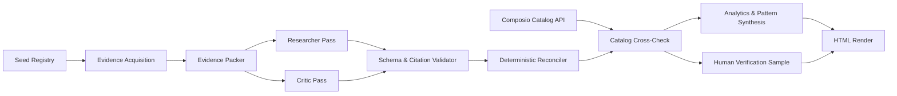

# Composio 100-App Buildability Audit

An evidence-grounded research pipeline that audits 100 assigned SaaS and developer applications from official public documentation to evaluate their buildability as agent-callable toolkits.

## Links

- **Live Case Study:** [https://0xnotdev.github.io/Composio_research_agent/](https://0xnotdev.github.io/Composio_research_agent/)
- **Deliverable Note:** This repository and interactive report form the submission for the Composio AI Product Ops take-home assessment.

## What this answers

This audit determines which of the 100 assigned target applications can be built as agent-callable toolkits today, identifying specific authentication, API surface, and commercial access constraints for each. All conclusions are strictly grounded in official public vendor documentation, preserving explicit missing evidence and technical gaps rather than guessing unsupported features.

## Headline result

Out of 100 audited applications across 10 categories:
- **68 apps are ready now** with clear self-serve access and documented API surfaces.
- **10 apps are buildable with access constraints**, requiring paid plans, admin approval, or sales/partner onboarding.
- **22 apps have insufficient evidence** in official documentation to verify buildability without further targeted retrieval.
- **70 apps offer self-serve credential paths** (free tier, developer account, or self-service portal), and **63 support OAuth2**.
- Overall evidence coverage across required research fields is **64.7%**.

For the complete interactive breakdown, matrix filtering, and evidence links, view the [Live Case Study](https://0xnotdev.github.io/Composio_research_agent/).

## Architecture



1. **Seed Registry (`data/apps_100.json`):** Asserts the immutable 100-app roster across 10 categories (10 apps per category) and enforces source policy allowlists before execution.
2. **Evidence Acquisition Adapter (`agent/evidence_fetcher.py`):** Composio-first documentation retrieval (`COMPOSIO_SEARCH_WEB` and `COMPOSIO_SEARCH_FETCH_URL_CONTENT`) with a direct public-HTTP fallback. Only accepts official vendor domains/repos.
3. **Deterministic Evidence Packer (`agent/evidence_packer.py`):** Pure-code stage that converts page content, extracts targeted keyword paragraphs, assigns immutable excerpt IDs (`E01`, `E02`), and caps payload sizes.
4. **Researcher Agent (`agent/researcher.py`):** Primary batch LLM pass that maps evidence excerpts to auth, access, API, MCP, and viability fields using strict `E##` citation rules.
5. **Critic Agent (`agent/critic.py`):** Independent adversarial batch LLM pass that re-derives fields and flags unsupported researcher assertions.
6. **Schema & Citation Validator (`agent/validator.py`):** Code-level anti-hallucination gate that rejects malformed output, unapproved sources, invalid enums, and uncited factual claims.
7. **Deterministic Reconciler (`agent/reconcile.py`):** Pure code decision engine that applies precedence rules to combine researcher and critic passes while preserving conflict history.
8. **Composio Catalog Cross-Check (`agent/composio_catalog.py`):** Secondary signal matching audited apps against `composio.toolkits.list()` to check existing ecosystem coverage without overwriting primary vendor doc evidence.
9. **Analytics & Pattern Synthesis (`agent/analytics.py`, `agent/pattern_agent.py`):** Calculates exact portfolio metrics in code and synthesizes evidence-constrained qualitative patterns.
10. **Human Verification Sample (`agent/verification.py`):** 12-app stratified review sample for measuring real pass-one vs. final accuracy.
11. **HTML Case Study Renderer (`agent/render_case_study.py`):** Single-file renderer producing the standalone, interactive static dashboard (`site/index.html`).

## Key design decisions

- **Researcher + Critic agreement is NOT human verification:** Model-to-model consensus indicates string-level agreement (`corroborated_primary`), not ground-truth accuracy. True accuracy is measured solely on the manually checked 12-app human sample.
- **Unsupported fields are nulled instead of guessed:** If official evidence is absent or citations fail validation, fields are set to `null` (`insufficient_evidence`) rather than relying on LLM parametric memory.
- **Composio SDK/Catalog is a secondary cross-check, not sole truth:** Catalog presence (`composio.toolkits.get()`) provides ecosystem context, but vendor documentation remains the primary source for buildability claims.
- **Reconciliation is deterministic code, not an LLM call:** Field precedence, conflict detection, and final buildability verdicts are evaluated by pure Python logic to eliminate non-deterministic resolution loops and conserve API budget.
- **Strict budget cap:** Designed for OpenRouter free-tier limits, capping total run execution at 34–48 LLM requests via 6-app batching.

## Repo structure

```text
├── agent/
│   ├── agent_output.py          # Strict JSONL parsing shared by researcher and critic stages
│   ├── analytics.py             # Aggregate statistics, prioritisation, and portfolio calculations
│   ├── composio_catalog.py      # Composio SDK catalog cross-checking and matching
│   ├── config.py                # Configuration and environment settings
│   ├── create_verification_sample.py # CLI script to create the 12-app verification sample worksheet
│   ├── critic.py                # Adversarial critic agent pass for challenging researcher claims
│   ├── evidence_fetcher.py      # Composio-first evidence acquisition with HTTP fallback
│   ├── evidence_packer.py       # Pure-code evidence selection, excerpt extraction, and prompt packing
│   ├── llm_client.py            # OpenRouter LLM client wrapper with caching and rate limiting
│   ├── models.py                # Pydantic data models defining the canonical schema and audit records
│   ├── pattern_agent.py         # Portfolio analysis agent generating evidence-backed pattern insights
│   ├── pipeline.py              # Main CLI pipeline runner orchestrating batch execution
│   ├── reconcile.py             # Pure-code deterministic reconciliation and decision engine
│   ├── redaction.py             # Redaction helper for sanitizing sensitive tokens in logs
│   ├── render_case_study.py     # Single-file, dependency-free HTML case-study renderer
│   ├── researcher.py            # Primary batch researcher agent pass
│   ├── seed.py                  # Seed registry loader and validation for assigned 100 apps
│   ├── simulated_reviewer.py    # Automated AI-simulated reviewer diagnostic pass
│   ├── source_policy.py         # Domain allowlist and official source validation logic
│   ├── storage.py               # File storage and directory management for run artifacts
│   ├── validator.py             # Schema and citation validator enforcement logic
│   ├── verification.py          # Verification metrics calculation for human and simulated samples
│   └── verify_sample.py         # CLI script to score the manual verification worksheet
├── data/                        # App seed roster, domain policy, and run output artifacts
├── site/                        # Standalone rendered HTML case study (index.html)
└── tests/                       # Offline unit test suite
```

## How to run it

### Setup

1. Create a Composio project and obtain its project API key.
2. Obtain an OpenRouter key and choose a currently available free model after preflight.
3. Copy `.env.example` to `.env` and fill `COMPOSIO_API_KEY`, `OPENROUTER_API_KEY`, and `OPENROUTER_MODEL`.
4. Run the offline test suite:

```powershell
python -m unittest discover -s tests -v
```

If `python` is unavailable on PATH in Codex Desktop, use its bundled runtime documented by the desktop environment.

### Run order

First inspect the live Composio search-tool schema and run only two representative apps:

```powershell
python -m agent.pipeline preflight --apps slack github --run-id preflight-1
```

Inspect raw evidence, citations, validator errors, and Composio transport behavior under `data/runs/preflight-1/`. Only then run all 100:

```powershell
python -m agent.pipeline run --run-id audit-1
```

Render the static page after completing human verification:

```powershell
python -m agent.render_case_study --dataset data/runs/audit-1/dataset_final.json --analytics data/runs/audit-1/analytics.json --verification data/runs/audit-1/verification_results.json --output site/index.html --generated-at 2026-07-27
```

Complete the generated `verification_sample.json` using the linked official documentation. For each reviewed field, enter the grounded value, mark whether pass one and the reconciled pre-human value are correct, and retain the source URL. Then calculate the displayed accuracy figures deterministically:

```powershell
python -m agent.verify_sample --sample data/runs/audit-1/verification_sample.json --output data/runs/audit-1/verification_results.json
```

#### Time-boxed simulated reviewer diagnostic

If no person is available before a deadline, the project can run a separate AI-simulated reviewer over retained official-source excerpts. This is explicitly labelled **not human validation** in both its artifact and the rendered page; it must not be represented as a human accuracy claim or substitute for the manual worksheet.

```powershell
python -m agent.simulated_reviewer --dataset data/runs/audit-1/dataset_final.json --sample data/runs/audit-1/verification_sample.json --output data/runs/audit-1/simulated_review.json
```

To regenerate an untouched worksheet using the highest-coverage app in each category plus two difficult cases, run:

```powershell
python -m agent.create_verification_sample --dataset data/runs/audit-1/dataset_final.json --output data/runs/audit-1/verification_sample.json
```

Generate four evidence-constrained, agent-written portfolio patterns from the deterministic metrics, then include them when rendering the case study:

```powershell
python -m agent.pattern_agent --analytics data/runs/audit-1/analytics.json --output data/runs/audit-1/patterns.json
python -m agent.render_case_study --dataset data/runs/audit-1/dataset_final.json --analytics data/runs/audit-1/analytics.json --patterns data/runs/audit-1/patterns.json --output site/index.html --generated-at 2026-07-28
```

The one-app proof reuses the exact pipeline:

```powershell
python research_one_app.py "Slack" --run-id proof-slack
```

It intentionally accepts only an app from the assigned set: arbitrary names would make an “official source” claim unsafe without an approved domain policy.

## What's verified, what's still open

- **Easy-win / outreach thresholds under-count:** The current easy-win/outreach thresholds are stricter than the underlying evidence supports for several categories, so this list under-counts real candidates — the full 100-row matrix is the reliable source until that threshold logic is corrected.
- **Pending human verification:** Manual human verification of the 12-app sample is partially complete at submission time; accuracy figures currently reflect the AI-simulated diagnostic only and are explicitly not a human-validated result.

## Further reading

| Document | Content & Purpose |
| --- | --- |
| [ARCHITECTURE.md](ARCHITECTURE.md) | Full technical architecture, component contracts, and guardrails |
| [composio_agent_spec.md](composio_agent_spec.md) | Original design specification and requirements |
| [PLAN.md](PLAN.md) | Initial implementation plan and execution steps |
| [PROGRESS.md](PROGRESS.md) | Checkpoint history and current audit execution status |
| [BUILD_HANDOFF.md](BUILD_HANDOFF.md) | Verification and build handoff documentation |
